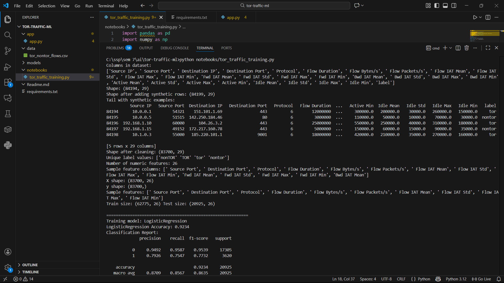
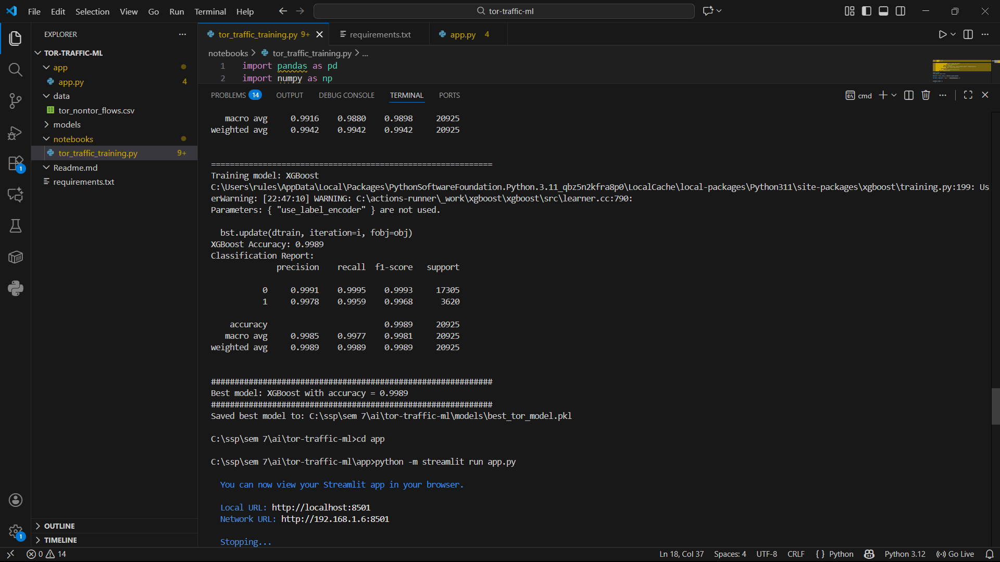
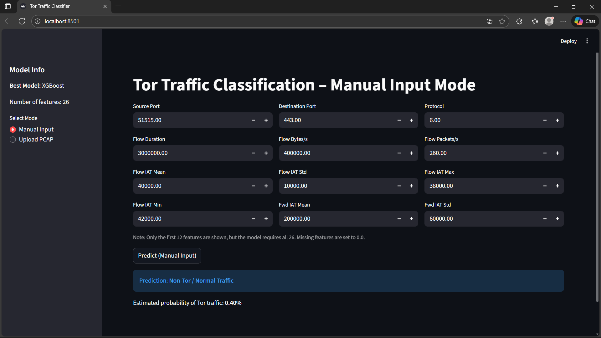
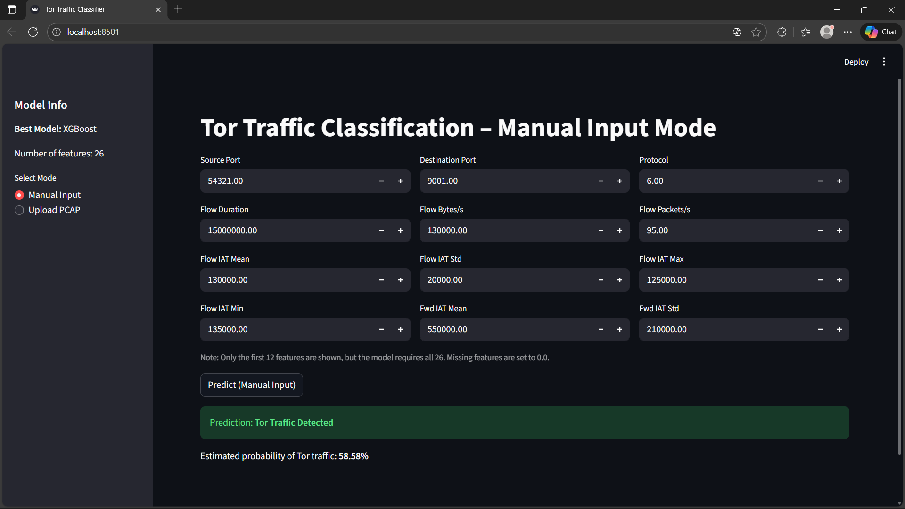
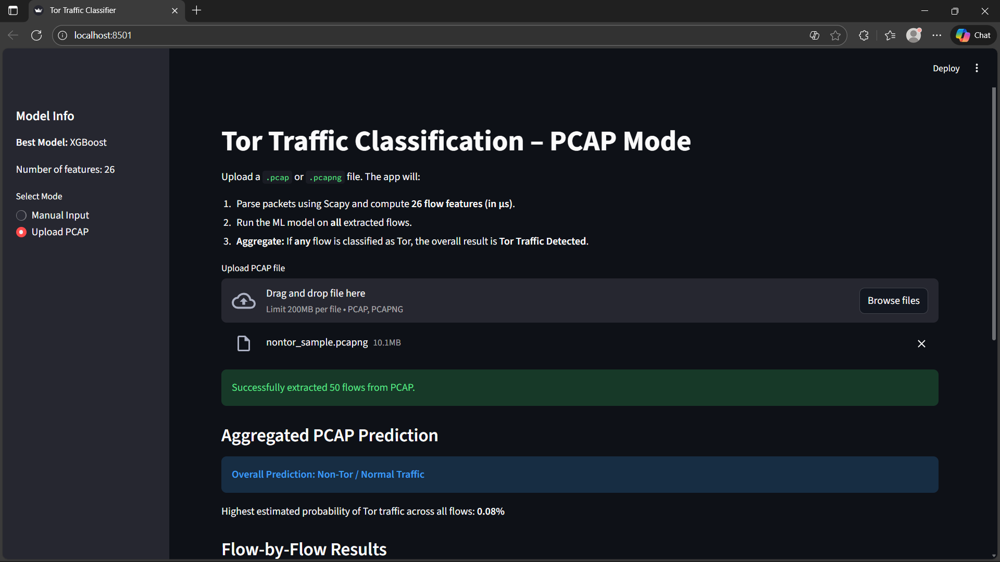
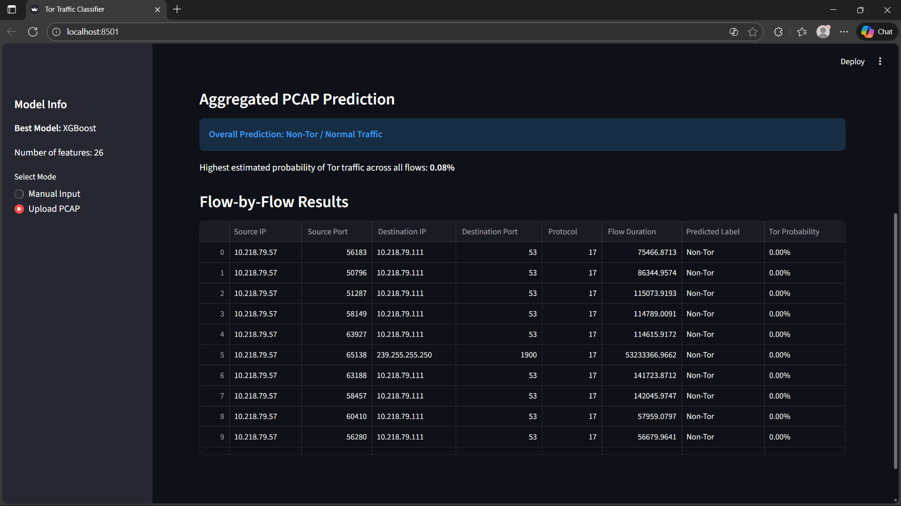
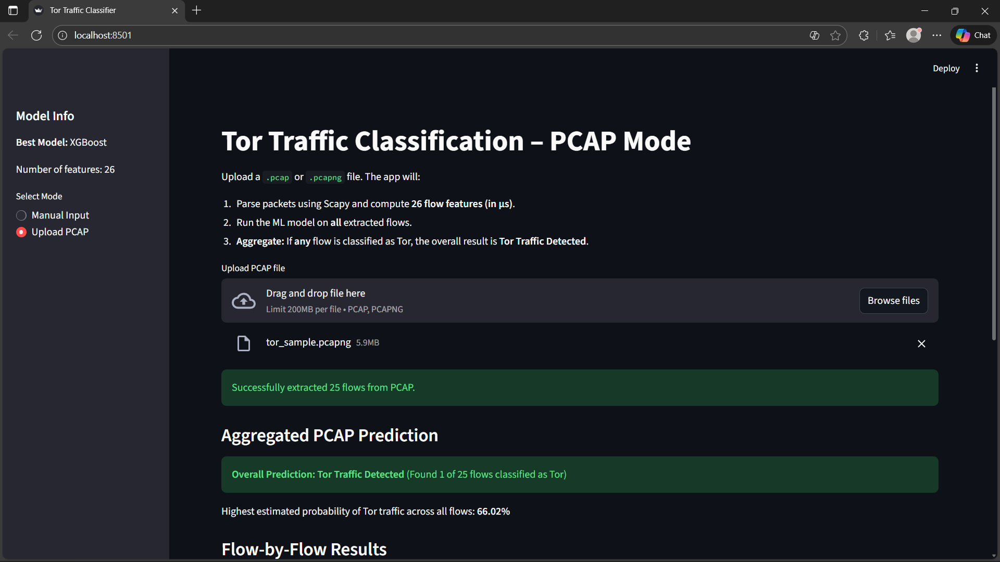
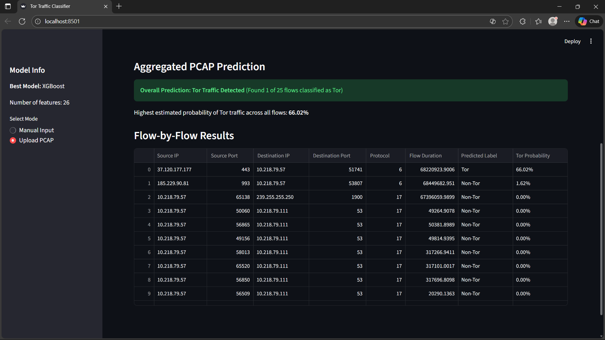

# Tor Traffic Classifier

## Overview
Tor Traffic Classifier is a machine learning project designed to distinguish Tor and Non-Tor traffic using statistical flow features extracted from PCAP files.

The project includes:
- Complete ML pipeline for preprocessing, training, evaluation.
- Automated flow extraction workflow for PCAP files.
- Multiple algorithms tested and compared (including XGBoost).
- Final model exported as a `.pkl` file.
- Streamlit web app for real-time classification.
- Screenshots of model training and prediction outputs.
- Full dataset uploaded inside the repository.
This solution solves the challenge of accurately identifying Tor traffic even during onion site browsing, leveraging enriched flow-level statistics and an intelligent aggregation strategy.
---

## Core Goal
To accurately classify Tor traffic using machine learning on flow-level statistical features and provide a deployable interface for real-time prediction.

---

## Technical Highlights

| Feature | Description |
|--------|-------------|
| Full Feature Set | Uses ~26 flow features: IAT stats, active/idle times, packet length stats, rate stats, and more. |
| Time-Unit Fix | Ensures all time features are converted to microseconds for compatibility with the trained model. |
| Aggregated PCAP Prediction | Each flow is analyzed individually and results are aggregated for a final PCAP-level decision. |
| Multiple Model Training | Logistic Regression, SVC, and Random Forest models tested; best accuracy model saved as `.pkl`. |
| Streamlit Deployment | Includes UI for both manual feature input and full PCAP file upload. |

---

## Repository Structure

```

AI_2025_TA2/
│
├── data/ # Training dataset (CSV)
│   └── tor_nontor_flows.csv
├── models/ # Final trained model artifact
│   └── best_tor_model.pkl
├── app/ # Streamlit application
│   └── app.py
├── notebooks/ # Training scripts and experimentation
│   └── tor_traffic_training.py
│
├── README.md # Documentation
└── requirements.txt # Python dependencies
```

---

## How the System Works

### 1. Data Preparation
PCAP files are converted into flow CSV files using an automated CICFlowMeter-like extraction pipeline.  
Features include:
- Flow IAT statistics  
- Active and idle durations  
- Packet length distributions  
- Source/destination rate characteristics  

### 2. Model Training
Four ML models are trained:
- Logistic Regression  
- Support Vector Classifier (SVC)  
- Random Forest
- XGBoost  

Accuracy scores are compared and the best performing model is exported as `best_tor_model.pkl`.

### 3. Prediction Workflow
- Flow CSV input is preprocessed using the same steps applied during training.
- Model outputs probability for Tor vs Non-Tor.
- For PCAPs, each flow is evaluated and the results are aggregated.

---


## Technology Stack

| Component | Technology |
|----------|------------|
| Frontend / App | Streamlit |
| Machine Learning | Scikit-learn, XGBoost |
| PCAP Flow Extraction | Scapy |
| Data Processing | Pandas, NumPy |
| Model Persistence | Python pickle |

---

## Running the Streamlit App

Install dependencies:
```
pip install -r requirements.txt
```


Start the app:
```
streamlit run app/app.py
```

App features:
- Manual feature input for single-flow prediction.
- Full PCAP upload for multi-flow analysis.
- Aggregated prediction summary.

---

## Dataset Information
The training data for this project is a collection of labeled Tor and Non-Tor network flows featuring 26 statistical characteristics.

**Credit**: The dataset is based on flow features extracted from the public traffic dataset provided by the **Canadian Institute for Cybersecurity (CIC)**.

**Detailed Dataset Information**: `https://www.unb.ca/cic/datasets/tor.html`

---

## Screenshots Included
The repository contains screenshots demonstrating the project's functionality:
- **Model Training Output**: Shows accuracy comparisons and the final selected model.





---

- **Manual Prediction Sample**: Demonstrates a high-latency flow correctly classified as Tor.




---

- **PCAP-level Classification**: Shows the aggregated prediction summary for a multi-flow PCAP upload.






---

## Future Improvements
- Integration of deep learning-based sequence models (e.g., using LSTMs)  
- Real-time sniffing and live traffic classification without requiring PCAP files 
- Larger, more diverse dataset of Tor traffic  
- Automated hyperparameter tuning for classifier robustness

---

## Author
Developed by **Jatin Agarwal**, 2025.
